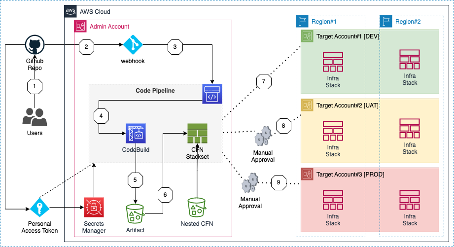

# CICD-Code-Pipeline

## Description
Purpose of this CloudFormation stack is to creates CICD AWS pipeline which allows you to deploy your required-infrastructure across different AWS-accounts and AWS-regions. Along with AWS-Code-Pipeline, this solution utilizes following components:
    - Code Source : GitHub repository
    - Code Build: AWS CodeBuild (with CFN-NAG and CFN-Lint integration for code validation)
    - Deployment: Infrastructure is deployed using CFN-Stacksets

## File Structure:
- iam.yml
- root.yml
- taget_account_iam_role.yml
- README.md

### Pre-Requisite for installation:
- Create Infrastructure Code:
    - Create Cloudformation code which would create the desired cloud infrastructure
    - Store all the nested files (if any) within pre-existing S3-bucket (created to store CFN-nested files)
- Setup GitHub Repository:
    - Setup GitHub repository with desired folder structure and branching structure
    {Note: The code pipeline will work within single "main/master" branch}
    - Store the infrastructure code (CFN templates) within GitHub Repo
- Create Webhook:
    - Create “Personal Access Token” in Github which would allow AWS to connect with given Github Repository
    - Store the given “Personal Access Token” within AWS Secret Manager (this secret-manager key-value will be used by the given code).

## Installation Process:
- Deploy "iam.yml" template
    - This would deploy and create all the IAM roles required by CICD pipeline to create all the Code-pipeline resources and CFN-stacksets.

- Deploy "taget_account_iam_roles.yml" template
    - Deploy this in all the desired target accounts (dev, uat and prod respectively)
    - This stack creates ‘AWSCloudFormationStackSetExecutionRole’ which grant access to admin-account to deploy stackset within target account(s)

- Deploy "cicd_pipeline.yml" template
    - This is the root stack which would create the CICD pipeline

## CodePipeline Topology:
- Resources:
    - AWS IAM Roles
    - AWS Code Build
    - AWS StackSets

## Roadmap
- Depending on the use-case, modify the code to use multiple source branches to create codepipeline with multiple branches
- Add or remove more target accounts and AWS-regions as per the use-case
